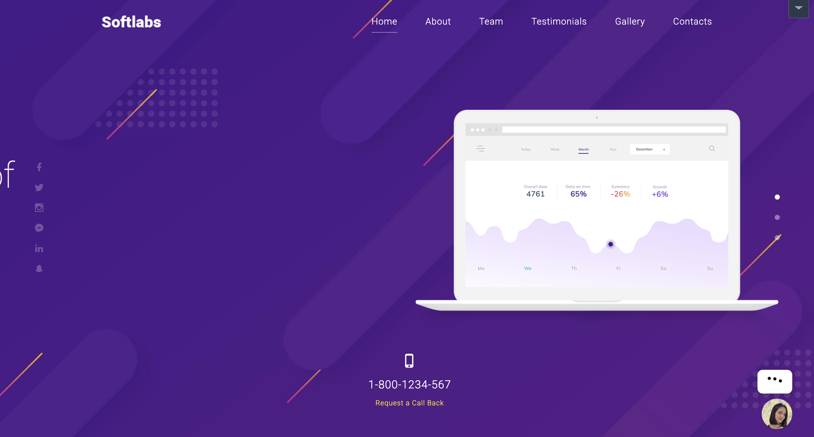
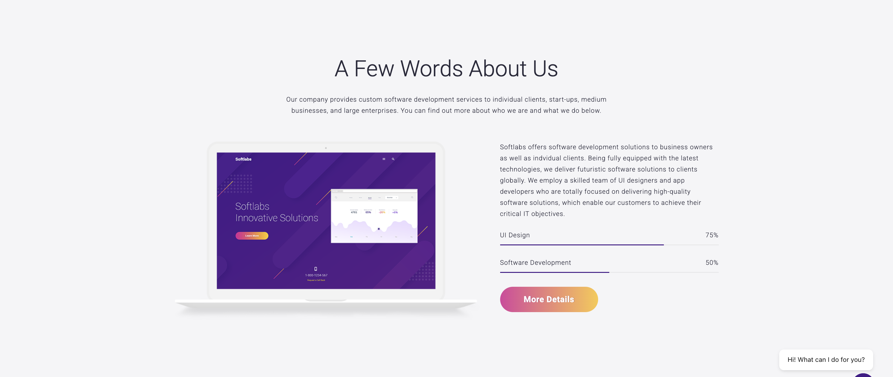
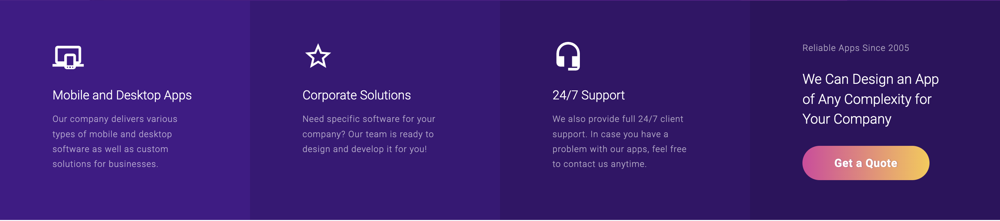
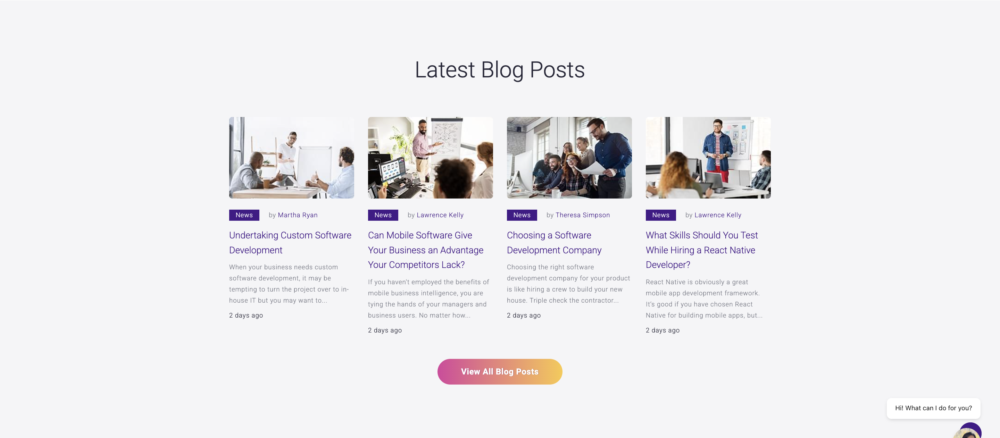
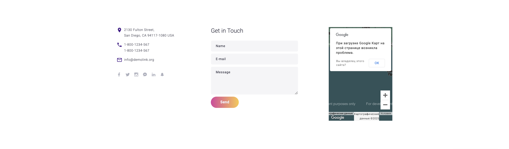

# 💼 Personal Portfolio Website

This personal portfolio website was built from scratch using **HTML**, **CSS**, and **JavaScript**. The design was inspired by the [TemplateMonster 77619](https://demo.templatemonster.com/demo/77619.html) template. The site is fully **responsive** and enriched with **interactive** features.

---

## 📌 Implemented Features

- All sections were created using HTML and CSS.
- JavaScript was used to change the **navbar background color** when scrolling.
- Buttons include a **to-right hover animation** with color transition.
- The hero section contains text that **automatically changes every 4 seconds**.
- The site is **responsive** and works on all screen sizes.

---

## 🔽 Website Sections

### 1. Hero Section
Includes a headline with text that changes every 4 seconds.

---

### 2. About us Section
Contains a brief description about me.

---

### 3. Services / Skills
Lists the services provided or skills possessed.

---

### 4. Latest blog posts
Displays previous works or project examples.

---

### 6. Contact Section
Includes contact information and a static contact form.

---

### 7. Footer
Bottom part of the site with social media links.

---

## 🛠 Technologies Used

- HTML5  
- CSS3 (Flexbox, Media Queries, Transition Effects)  
- JavaScript (scroll effects, text slider)

---

